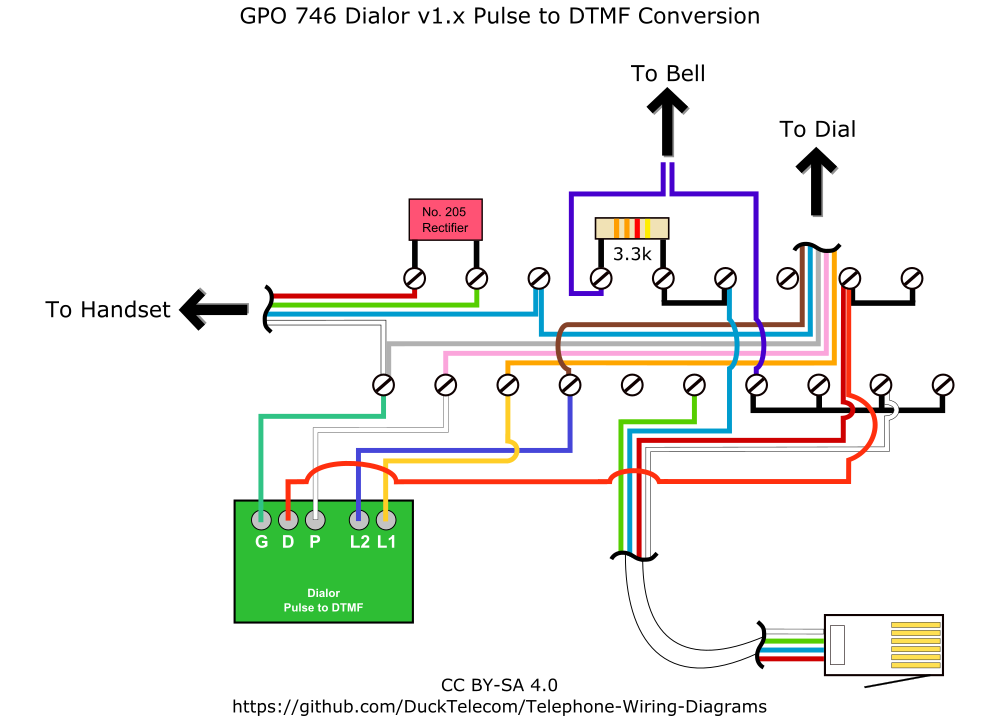

# Telephone Wiring Diagrams
A selection of wiring diagrams for telephones, mostly to aid with conversions.

## Images
### GPO 746 2 Wire Conversion
This wiring diagram shows how to wire a GPO 746 for 2 wire operation, using the in-built ring capacitor.  

### GPO 746 3 Wire Conversion
This wiring diagram shows how to wire a GPO 746 for 3 wire operation, using the bell wire.  

### GPO 746 3 Wire Conversion with Dialor v1.x pulse to tone converter.   
This wiring diagram shows how to wire a GPO 746 for 3 wire operation, with a Dialor v1.x pulse to tone converter.  

## Licence

This project is licensed under the [Creative Commons CC BY-SA 4.0](https://creativecommons.org/licenses/by-sa/4.0/) licence.

You are free to share and adapt the code as required, however you *must* give appropriate credit and indicate what changes have been made. You must also distribute your adaptation under the same license.

